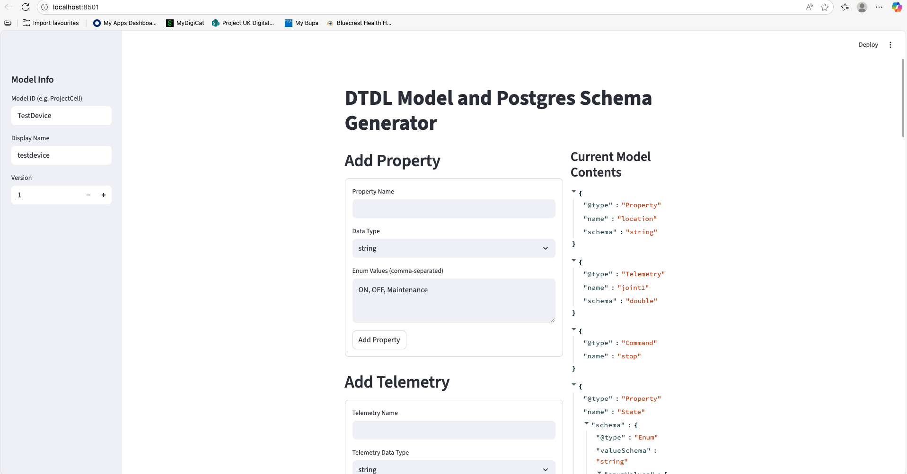
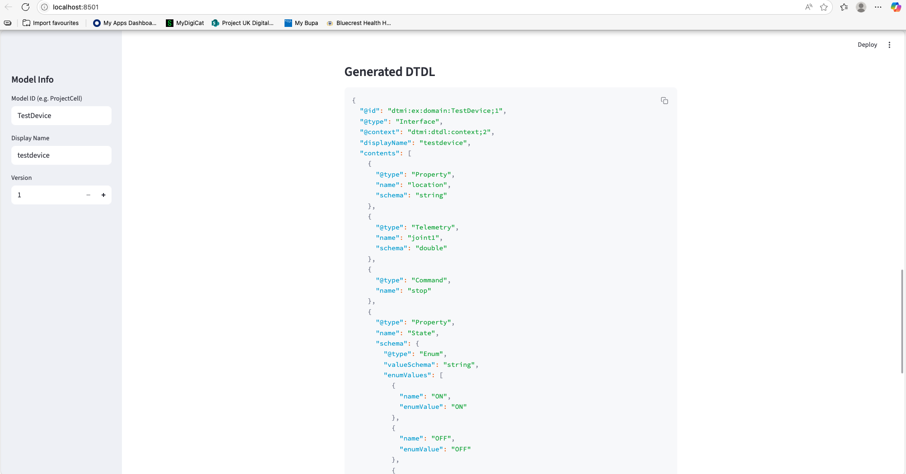
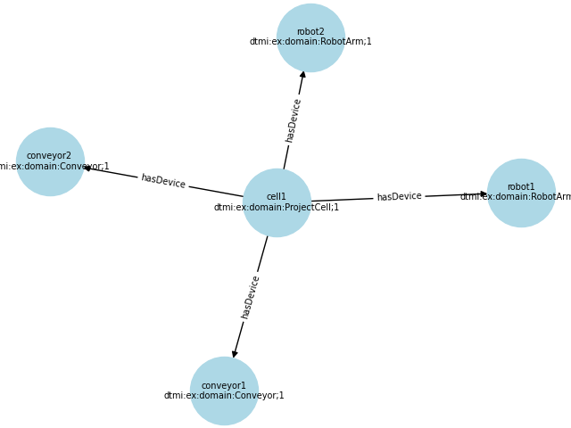

# Digital Twin Graphical Visualizer tool

This project has been built using UV package manager, please download it from the link below. 

https://docs.astral.sh/uv/getting-started/installation/

## How does this work ?

The models and twins folder contain json files of the DTDL files and their instanciated twin json files. When a new device is introduced into the process, it is recommended to create 
a DTDL json file using the DTDL Generator which is a streamlit program and can be accessed as follows

To create a venv or start the project with UV, you can either create a new testfile called "test.py" , 

```
# test.py
print("Hello world")
#run test.py
uv run test.py
```
This should get all the libraries in sync. 

```bash
# Test if the environment is active
streamlit
# it should display the library and its attributes

streamrun DTDL Generator/app.py
```

The program should allow you add a new asset by plugging in the values as need be, when you generate 


At the moment, there is no direct way to download the file, so you can just copy the output and paste it in your models folder
Once you have the Class created in the models folder, you can now call / use it to create a twin. 

**MODELS**
ProjectCell.json
```json
{
  "@id": "dtmi:ex:domain:ProjectCell;1",
  "@type": "Interface",
  "@context": "dtmi:dtdl:context;2",
  "displayName": "Project Cell",
  "contents": [
    { "@type": "Property", "name": "Throughput", "schema": "double" },
    {
      "@type": "Relationship",
      "name": "hasDevice",
      "target": "dtmi:ex:domain:Device;1",
      "minMultiplicity": 0,
      "maxMultiplicity": 50
    }
  ]
}

RobotArm.json
```json
{
  "@id": "dtmi:ex:domain:RobotArm;1",
  "@type": "Interface",
  "@context": "dtmi:dtdl:context;2",
  "extends": [ "dtmi:ex:domain:Device;1" ],
  "displayName": "Robot Arm",
  "contents": [
    { "@type": "Property", "name": "axisCount", "schema": "integer" }
  ]
}
```

Conveyor.json
```json
{
  "@id": "dtmi:ex:domain:Conveyor;1",
  "@type": "Interface",
  "@context": "dtmi:dtdl:context;2",
  "extends": [ "dtmi:ex:domain:Device;1" ],
  "displayName": "Conveyor",
  "contents": [
    { "@type": "Property", "name": "beltSpeed", "schema": "double" }
  ]
}
```
**TWINS**
You can instanciate twins as following

cell1.json
```json
{
  "$dtId": "cell1",
  "$metadata": { "$model": "dtmi:ex:domain:ProjectCell;1" },
  "Throughput": 120
}

```
conveyor1.json
```json
{
  "$dtId": "conveyor1",
  "$metadata": { "$model": "dtmi:ex:domain:Conveyor;1" },
  "manufacturer": "Kuku",
  "model": "KR6"
}
```
robot1.json
```json
{
  "$dtId": "robot1",
  "$metadata": { "$model": "dtmi:ex:domain:RobotArm;1" },
  "manufacturer": "Kuka",
  "model": "KR6"
}
```
Similarly , you can create as many devices as you want by using the models as the Class as in object oriented appraoch and twins as the instance. 

**RELATIONSHIPS**

Finally, we need to create relationships.This is donw in the relationships folder under the links.json

links.json
```json
[
  {
    "$relationshipId": "cell1-hasDevice-robot1",
    "$sourceId": "cell1",
    "$relationshipName": "hasDevice",
    "$targetId": "robot1"
  },
  {
    "$relationshipId": "cell1-hasDevice-robot2",
    "$sourceId": "cell1",
    "$relationshipName": "hasDevice",
    "$targetId": "robot2"
  },
  {
    "$relationshipId": "cell1-hasDevice-conveyor1",
    "$sourceId": "cell1",
    "$relationshipName": "hasDevice",
    "$targetId": "conveyor1"
  },
   {
    "$relationshipId": "cell1-hasDevice-conveyor2",
    "$sourceId": "cell1",
    "$relationshipName": "hasDevice",
    "$targetId": "conveyor2"
  }
]
```
## Using DTDL models , twins and relationaships to construct a graphical representation

The code *main.py* is designed to take in whatever json files you create in the models and twins as long as the links are created properly. 
```bash
uv run main.py
```
The output should be something like this.
 
